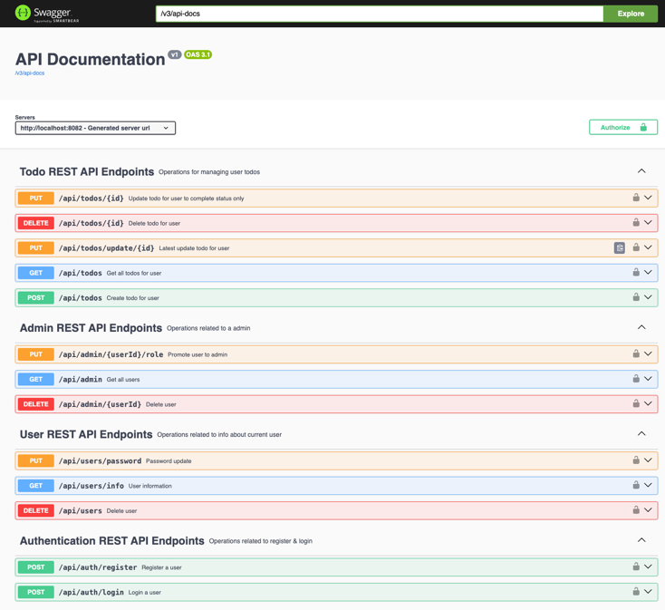

# Todos

Purpose:
This is a simple CRUD Todo Rest API project to create, fetch, update, and delete todo on the system/ database based on 
the authorities/ roles. Incorporated Admin Rest API Endpoints to administer users, 
get user information. Users will register themselves prior to login before creating their Todos.

## Tech Stack

* JWT - JSON Web Token 
* Spring Core
* Spring Data JPA
* Spring Actuator 
* Spring Security 
* Spring AOP 
* MySQL Database
* Spring Boot 3 
* Lombok 
* Maven 
* Java 21 
* Spring Boot Dev Tools
* Swagger
* Docker

## Tools
* IntelliJ Community Edition 
* Swagger 
* Github 
* Tomcat Server 
* DBeaver

## Project setup instructions
* Database Development 
  - Download and Install Docker Desktop
  - Download and Install MySQL Database image [docker-setup-resource.txt](docker-setup-resource.txt)
  - Download and Install DBeaver (Database client)
  - No Database scripts required. `spring.jpa.hibernate.ddl-auto=update` will create the todo schema and tables
* API Development
    - Download and Install Java JDK 21
    - Download and install IntelliJ Community Edition or IDE of your choice
    - Enable Lombok processing on your IDE
    - Run the code
* Testing
  - Use Swagger as alternative on http://localhost:8082/docs

## API endpoints
* Login to get JWT token generated using Swagger `/docs` endpoint
* Validate JWT Token using: https://jwt.io/
* Use the generated JWT token Authorize and consume all the endpoints

## Actuator endpoints

| HTTP Method | Endpoint |                      Action |
| :---         |     :---:      |----------------------------:|
| `GET`   | `/actuator/info` |         Read info about API |
| `GET`   | `/actuator/health` |          Read status of API |

## Communication

I hope you have fun with this project as had creating it. Please share your thoughts and experience: What you have 
learnt or to improve. Connect with me on: LinkedIn: https://www.linkedin.com/in/xola-mkhatshwa-966482a0/ or 
email: mkhatshwa.xola@gmail.com or [xolamkhatshwa.com](https://xolamkhatshwa.com/)

Thank you.

## Authors

[Xola Mkhatshwa](https://github.com/xmkhatshwa) | Software Engineer

mkhatshwa.xola@gmail.com | [xolamkhatshwa.com](https://xolamkhatshwa.com/)
